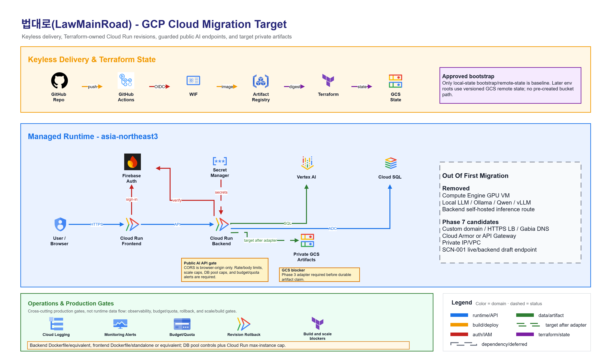
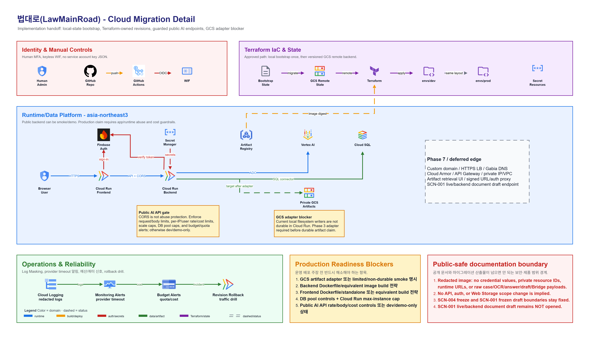

# 최종 아키텍처

기준일: `2026-05-13`

## 기술 스택

| Layer | Choice |
|---|---|
| Frontend | Next.js App Router, React, TypeScript |
| Backend | FastAPI |
| Database | PostgreSQL + pgvector |
| Login | Firebase Auth Google Sign-In + Firebase Admin SDK verification |
| LLM/OCR | Vertex AI Gemini |
| Embedding | `gemini-embedding-001`, 768 dimensions |
| Local environment | WSL Ubuntu + conda |
| Cloud target | Google Cloud, dev-first migration |

## 전체 시스템 흐름

```text
legalize-kr submodule
  -> preprocessing / chunking scripts
  -> backend/data/law_chunks/all_chunks.json
  -> PostgreSQL law_chunks + pgvector embeddings
  -> 법령 검색
  -> 법령 근거가 함께 제시되는 답변
  -> 지원되는 문서 초안
  -> Next.js frontend
```

## 클라우드 전환 아키텍처

아래 다이어그램은 내부 drawio 산출물에서 공개 가능한 범위만 남긴 이미지입니다.
실제 인증 정보, 비공개 클라우드 리소스 식별자, 서버 직접 실행 URL, 사건·OCR·답변·
초안·상담 연결 원문 데이터는 포함하지 않습니다. 이 그림은 개발 환경 우선 클라우드
전환과 공모전 데모 운영 상태를 설명하기 위한 자료이며, 장기 운영 서비스 준비 완료
선언을 의미하지 않습니다.

아래 이미지는 클릭하면 원본 PNG로 열 수 있습니다.

### Overview

[](images/architecture/cloud-migration-overview.png)

Overview는 GitHub Actions, WIF(키 파일 없이 배포 권한을 연결하는 방식),
Artifact Registry, Terraform, GCP 실행/데이터 플랫폼의 큰 흐름을 보여줍니다.
현재 공개 미러는 배포 권한을 가진 저장소가 아니며, 비공개 개발·배포 저장소와
공개 제출용 미러의 역할은
[[클라우드 전환과 공개 미러 정책|Cloud-Migration-and-Public-Mirror-Policy]]을
따릅니다.

### Detail

[](images/architecture/cloud-migration-detail.png)

Detail은 identity/WIF, Terraform IaC/state, Cloud Run frontend/backend,
Firebase Auth, Secret Manager, Vertex AI, Cloud SQL, 파일 저장 어댑터 후보,
운영/비용 가드레일을 한 화면에 정리합니다. 점선 또는 보류 표시된 항목은 후속 검토
후보이며, 계약서 검토 기반 서버 초안 생성 API는 현재 제공하지 않습니다.

## 실행 표면

| 영역 | 역할 | 공개 경계 |
|---|---|---|
| AI 법률 상담 | AI 법률 상담, 문서 초안, 사업장 변경 사유 정리서 예시 | 로그인 없이 사용 가능, 심사용 예시 우선 |
| 계약서 검토 | 계약서 검토와 상담 연결 시작 | 실제 분석은 로그인 후 사용, 세부 API 인증 경계는 API 문서 참조 |
| 사건 기록 | 사건 기록 보관함 | 서버 인증이 확인된 사용자만 |
| FastAPI public APIs | 법령 검색, 답변, 지원되는 초안 | 안정적인 공개 API 계약 |
| FastAPI login APIs | 기록, 상담 연결, 이어지는 답변 | Firebase 기반 서버 인증 확인 |

## Backend

Application boundary / 애플리케이션 경계:

- FastAPI application layer

핵심 책임:

- 법령 검색
- 법령 근거가 함께 제시되는 답변 생성
- 지원되는 문서 초안 생성
- Firebase token verification(서버에서 로그인 토큰 확인)
- 로그인 사용자용 상담 연결, 기록, 삭제 경로

공개 가능한 API 책임 영역:

- 법령 검색 API 영역
- 인증 상태 확인 API 영역
- 답변 생성 API 영역
- 지원되는 문서 초안 API 영역
- 로그인 사용자용 기록/상담 연결 API 영역

## Frontend

구현 routes(사용자 화면 경로):

- `/`
- `/before`
- `/after`
- `/after/result`
- `/after/intake`
- `/after/draft`
- `/history`

화면 상태는 React Context와 reducer 기반 메모리 상태로 관리합니다. 이는 화면 안에서만
상태를 이어 가는 방식이며, 민감한 원문
데이터는 브라우저 저장소에 저장하지 않습니다.

## 인증 경계

```text
Firebase Web SDK
  -> Firebase ID token
  -> Authorization: Bearer <id token>
  -> backend Firebase Admin verification
  -> backend-owned project account linkage
```

로그인 후 사용할 수 있는 기능은 서버 인증 확인을 요구합니다. AI 법률 상담은
로그인 없이 사용할 수 있습니다.

## 모델과 초안 경계

- 실시간 법령 검색과 답변 생성은 Vertex AI Gemini와 PostgreSQL + pgvector 검색을 사용할 수 있습니다.
- `임금체불·부당해고 상담` 예시를 그대로 제출하는 경로는 같은 결과를 재현할 수 있도록 화면에서 안정화되어 있으며 실시간 답변 생성을 호출하지 않습니다.
- `/api/v1/documents/draft`는 요청의 `case_intake`와 답변에서 추출된 `legal_basis`만 사용하는 결정적 초안 생성기입니다.
- `사업장 변경 사유 정리서 초안` 예시는 화면 내 생성 흐름이며 서버 초안 API를 호출하지 않습니다.
- 계약서 검토 결과는 사건 연결과 참고용 정보이며, 법적 근거가 아닙니다.

## 배포 운영 상태

클라우드 전환은 현재 개발 환경 우선입니다.

- first Terraform target: `dev`
- public demo status: `demo/contest`
- public demo URL: `https://www.law-main-road.cloud`
- 장기 운영 서비스 준비 완료 선언: 없음
- 장기 운영 서비스 전환: 별도 검토 필요

Phase 7A custom domain 연결은 `www` host에 한정되어 완료됐습니다. Same-origin
`/api/**`, root apex, `api.*`, HTTPS Load Balancer, Cloud Armor는 별도 gate입니다.

## 함께 보기

- [[데이터 모델과 개인정보 경계|Data-Model-and-Privacy]]
- [[API 문서|API-Endpoints-and-Schemas]]
- [[RAG와 법령 코퍼스|RAG-and-Law-Corpus]]
- [[클라우드 전환과 공개 미러 정책|Cloud-Migration-and-Public-Mirror-Policy]]
