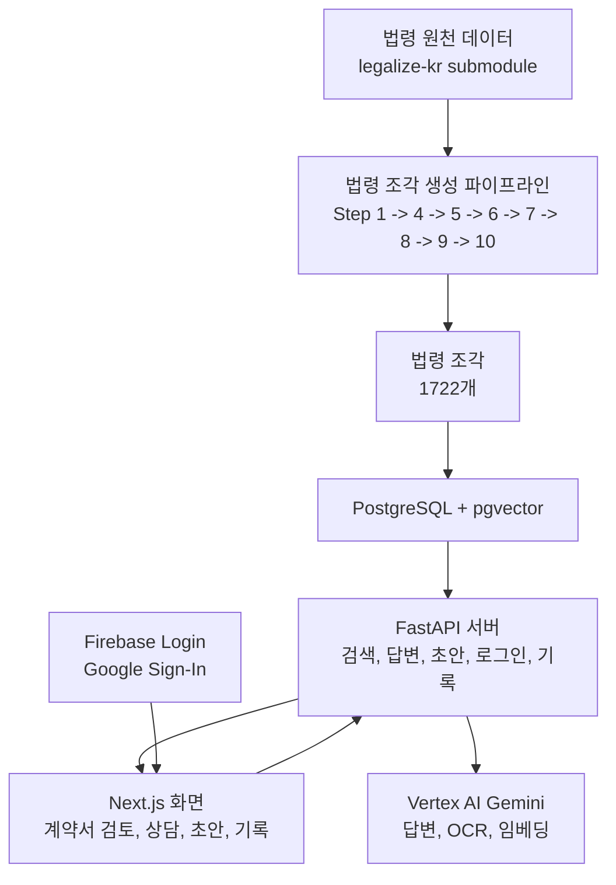

# 홈 (Home)

법대로(LawMainRoad)는 외국인 근로자와 취약 노동자가 근로계약, 임금체불,
부당해고, 사업장 변경 같은 노동 문제를 한국 노동법 근거와 함께 정리할 수
있도록 돕는 AI 지원 MVP입니다.

이 Wiki는 공개 README 이후 이어지는 상세 문서입니다. 사용자가 어떤 흐름을
확인할 수 있는지, 심사자가 어떤 구현 범위와 한계를 봐야 하는지, 보안과
개인정보 경계가 어디에 있는지를 공개 가능한 수준으로 설명합니다.

- 공개 데모: https://www.law-main-road.cloud
- 데모 시연 영상: [YouTube에서 보기](https://youtu.be/fFEPP3KtHMs)
- MP4 백업 파일: [브라우저에서 열기 또는 다운로드](https://raw.githubusercontent.com/Team-msp-architect-2026/msp-team02/main/docs/video/lmr_demo_web.mp4)

---

## 먼저 읽기

이 Wiki는 다음 순서로 읽는 것을 권장합니다.

1. [데모 시연 영상](https://youtu.be/fFEPP3KtHMs) - 전체 흐름을 빠르게 확인
2. [[프로젝트 수행 및 완성|Project-Execution-and-Completion]] - 프로젝트 요약과 현재 완료 범위
3. [[사용자 흐름|User-Flows]] - 계약서 검토, AI 법률 상담, 사건 기록 흐름
4. [[UI 화면 구성|UI-Screens]] - 실제 화면별 역할과 스크린샷
5. [[최종 아키텍처|Final-Architecture]] - 시스템 전체 구조와 주요 경계
6. [[RAG와 법령 코퍼스|RAG-and-Law-Corpus]] - 법령 데이터, 검색, 근거 답변 기준
7. [[E2E 데모 검증|E2E-Demo-Verification]] - 공개 가능한 검증 요약

---

## 프로젝트 상태

- 문서 최종 정리일: `2026-05-14`
- 구현 기준일: `2026-05-13`

| 영역 | 상태 |
|---|---|
| AI 법률 상담과 문서 초안 | 완료 |
| 계약서 검토 -> 상담 연결 흐름 | 완료 |
| 로그인 사용자용 사건 기록과 기록 삭제 | 완료 |
| 사업장 변경 사유 정리서 예시 초안 | 완료 |
| Google 로그인과 서버 인증 확인 | 완료 |
| 화면 시각 정리 | 2026-04-29 기준 정리 완료 |
| 클라우드 전환 | 개발 환경 기본 확인 후 공개 `www` 도메인 연결 완료 |
| Public demo URL | `https://www.law-main-road.cloud` |
| Demo video | YouTube `https://youtu.be/fFEPP3KtHMs` |
| MP4 backup | public mirror `docs/video/lmr_demo_web.mp4` |
| 장기 운영 서비스 선언 | 현재 제공하지 않음 |

---

## 제공 기능

- 한국 노동법 조각을 검색하고 법령 근거가 함께 제시되는 답변을 생성합니다.
- 검색된 법령으로 뒷받침되는 경우에만 인용 조문을 표시합니다.
- 계약서, 기숙사, 공제, 사업장 변경 관련 위험 신호를 검토합니다.
- 계약서 검토 결과를 AI 법률 상담 질문에 연결합니다.
- 답변에서 확인된 법적 근거를 바탕으로 지원되는 문서 초안을 생성합니다.
- 로그인 사용자에게 사건 기록과 기록 삭제 기능을 제공합니다.

---

## 공개 문서 경계

이 Wiki는 내부 개발 기록을 그대로 공개하지 않습니다. 구현 근거를 바탕으로,
사용자와 심사자가 알아야 하는 현재 제공 기능, 한계, 검증 근거, 보안 경계만 다시
정리했습니다.

문서의 기준은 현재 구현 상태입니다. 오래된 설계 메모와 충돌하는 경우 AI 법률 상담
데모 안정성, 로그인 사용자용 계약서 검토 흐름, 개발 환경 우선 클라우드 전환 정책,
공개 미러 정책을 우선합니다.

---

## 범위 경계

구현됨:

- 로그인 없이 사용할 수 있는 AI 법률 상담 흐름
- 서버 인증이 확인된 계약서 검토/사건 기록 흐름
- Firebase Google Sign-In과 서버 인증 확인
- PostgreSQL + pgvector 기반 법령 검색
- 예시 사례를 통한 안정적인 데모 확인
- 사용자 화면의 한국어 요약과 명확한 주의 문구

현재 제공하지 않음:

- 계약서 검토 기반 초안 생성을 서버 기능으로 제공하는 기능
- 계약서 검토 기반 초안 생성 전용 로그인 API
- 독립 상담 연결 전용 화면
- Recovery 흐름
- 추가 문서/상담 시나리오 확장
- root apex / `api.*` domain / same-origin `/api/**` 라우팅
- HTTPS Load Balancer / Cloud Armor
- 완전 삭제, 파일 물리 삭제, 보관 기간 정책
- 장기 운영 서비스 선언

---

## 아키텍처 개요

---

## Wiki 내비게이션

### 기초 문서

- [[프로젝트 수행 및 완성|Project-Execution-and-Completion]]
- [[범위 및 비목표|Scope-and-Non-Goals]]
- [[설계 원칙|Design-Principles]]

### 아키텍처

- [[최종 아키텍처|Final-Architecture]]
- [[RAG와 법령 코퍼스|RAG-and-Law-Corpus]]
- [[데이터 모델과 개인정보 경계|Data-Model-and-Privacy]]
- [[보안 모델|Security-Model]]

### 제품과 API

- [[사용자 흐름|User-Flows]]
- [[UI 화면 구성|UI-Screens]]
- [[API 문서|API-Endpoints-and-Schemas]]

### 배포와 운영

- [[배포와 실행 가이드|Deployment-and-Setup-Guide]]
- [[클라우드 전환과 공개 미러 정책|Cloud-Migration-and-Public-Mirror-Policy]]
- [[트러블슈팅 런북|Runbook-Troubleshooting]]

### 품질과 참고

- [[테스트 전략|Testing-Strategy]]
- [[E2E 데모 검증|E2E-Demo-Verification]]
- [[ADR 설계 결정|ADR-Design-Decisions]]
- [[용어집|Glossary]]
