# UI 화면 구성

법대로(LawMainRoad)는 계약서 검토, AI 법률 상담, 문서 초안, 사건 기록 화면을
제공합니다. 화면 문구는 한국어를 우선하고, 영어 표현은 기술 라벨이나 보조 설명에만
사용합니다.

## 화면별 역할

| 화면 | 역할 | 현재 상태 |
|---|---|---|
| 메인 | 서비스 진입, 로그인 안내, 주요 화면 이동 | 구현됨 |
| 계약서 검토 | 계약서 업로드, 진행 상태, 결과, 상담 연결 버튼 | 구현됨 |
| AI 법률 상담 입력 | 질문 입력, 예시 사례, 저장된 사건 선택 | 구현됨 |
| 답변 결과 | 법령 근거가 함께 제시되는 답변, 문서 초안 가능 여부, 상담 연결 요약 | 구현됨 |
| 문서 정보 입력 | 문서 유형에 필요한 사실관계 입력 | 구현됨 |
| 문서 초안 | 초안 본문, 추가 필요 정보, 주의사항, 복사, 인쇄 | 구현됨 |
| 사건 기록 | 사건 기록 보관함과 기록 삭제 | 구현됨 |

## 메인 화면

- 로그인 전 첫 화면은 Google 로그인을 우선 안내합니다.
- 서버 인증이 확인된 로그인 사용자는 사건 기록, 계약서 검토, AI 법률 상담 순서로 진입점을 봅니다.
- AI 법률 상담은 로그인 없이도 사용할 수 있습니다.

| 첫 화면 | 스크롤 전체 흐름 |
|---|---|
| <a href="images/screens/home-hero.png">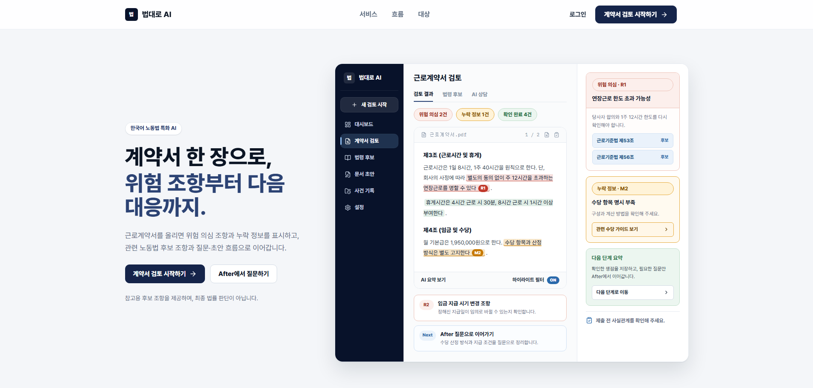</a> | <a href="images/screens/home-scroll.png">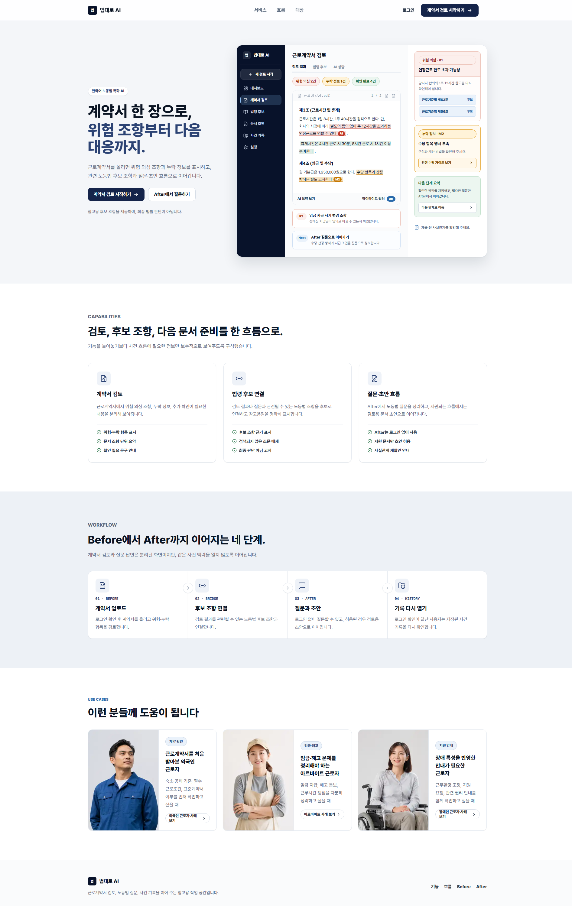</a> |

## 계약서 검토 화면

- 첫 화면은 문서 업로드에 집중합니다.
- 분석이 시작되면 진행 상태 영역으로 이동합니다.
- OCR 안내 문구는 문서 품질과 길이에 따라 약 1~2분 걸릴 수 있음을 설명합니다.
- 작업 식별자, 제공자 세부 정보, 내부 오류는 사용자 화면에 표시하지 않습니다.
- 로그인 사용자의 완료된 계약서 검토 결과는 AI 법률 상담에 연결할 수 있습니다.

| 확인 중 상태 | 외국인 근로자 계약 검토 결과 |
|---|---|
| <a href="images/screens/scn001-before-progress.png">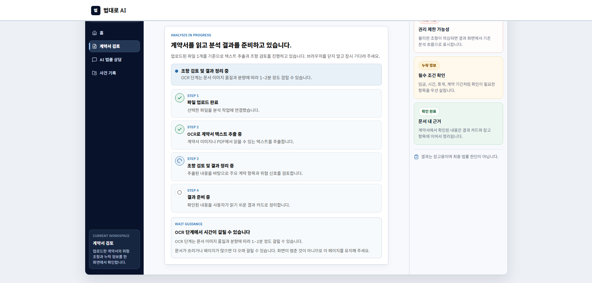</a> | <a href="images/screens/scn001-before-foreign-worker-result.png">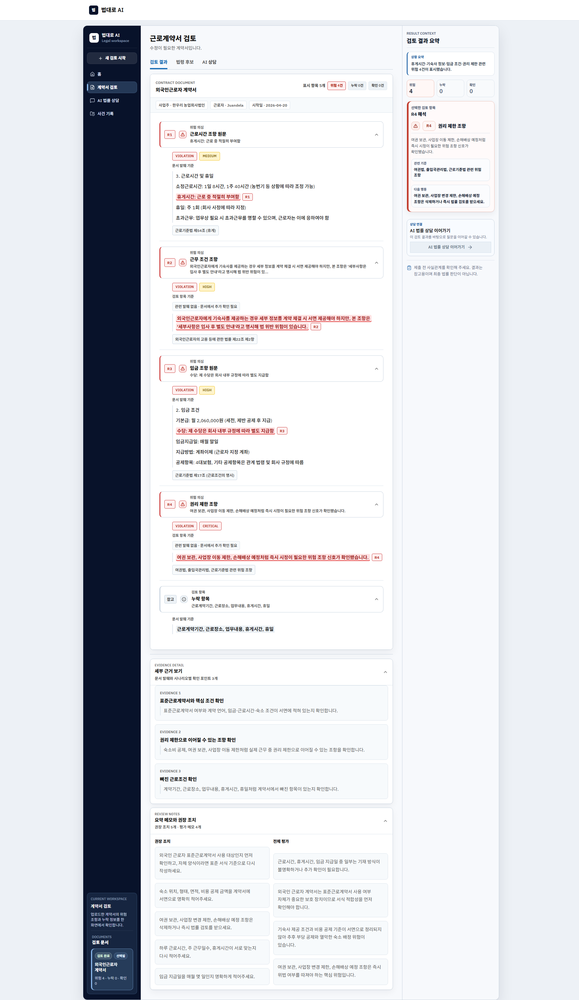</a> |

| 아르바이트 계약 검토 | 장애 특성 반영 계약 검토 |
|---|---|
| <a href="images/screens/before-contract-part-time.png">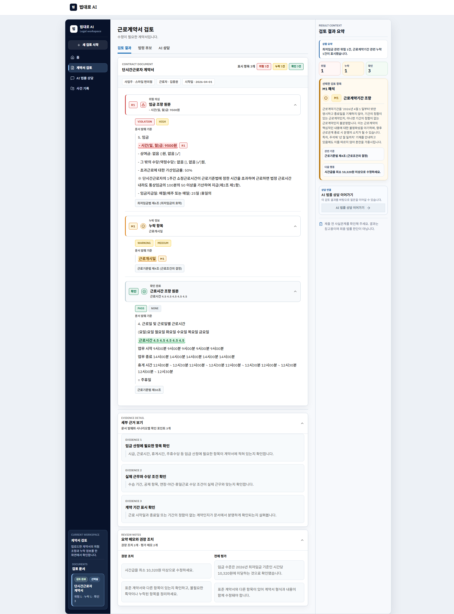</a> | <a href="images/screens/before-contract-accessibility.png">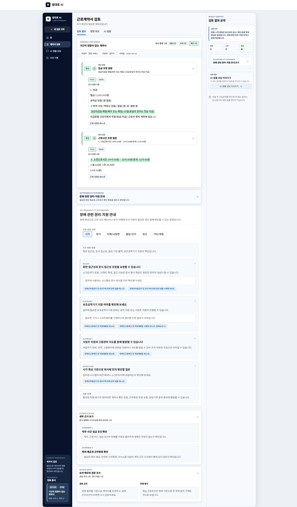</a> |

<a href="images/screens/scn001-before-scroll.png">
  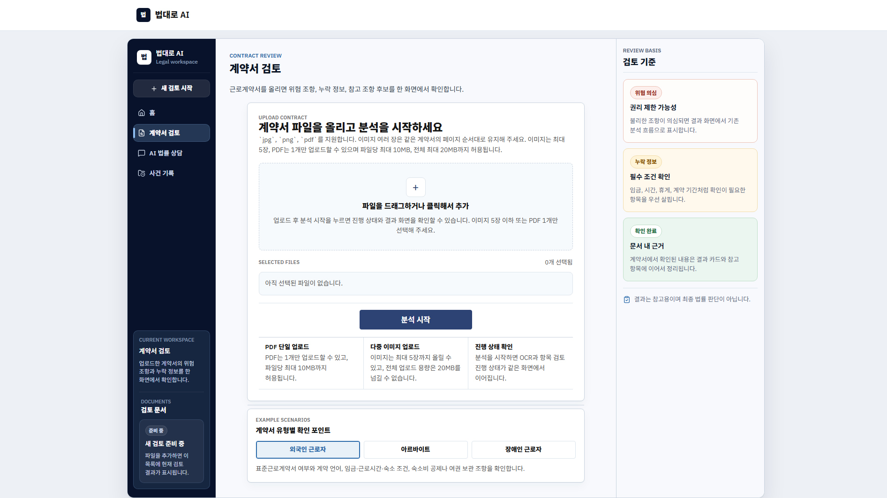
</a>

## AI 법률 상담 입력 화면

- 저장된 계약서 검토 결과가 있어도 예시 사례 버튼은 계속 표시됩니다.
- `임금체불·부당해고 상담` 예시는 법령 근거가 함께 제시되는 답변과 지원되는 문서 초안으로 이어집니다.
- `사업장 변경 사유 정리서 초안` 예시는 화면 안에서 초안을 작성합니다.
- 예시를 수정하거나 직접 입력하면 현재 구현된 법령 검색과 답변 생성을 사용합니다.
- 저장된 사건 기록 선택 영역은 서버 인증이 확인된 로그인 사용자에게만 표시됩니다.

| AI 법률 상담 입력 | 부당해고 법률 상담 | 외국인 근로자 법률 상담 |
|---|---|---|
| <a href="images/screens/scn001-after-entry.png">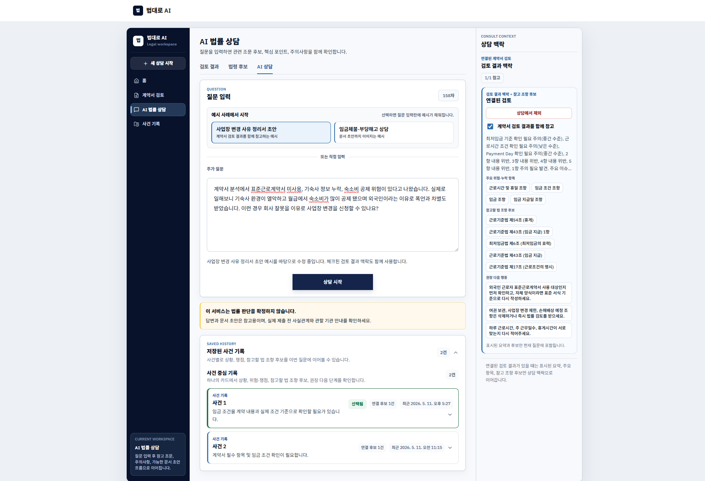</a> | <a href="images/screens/after-consult-dismissal.png">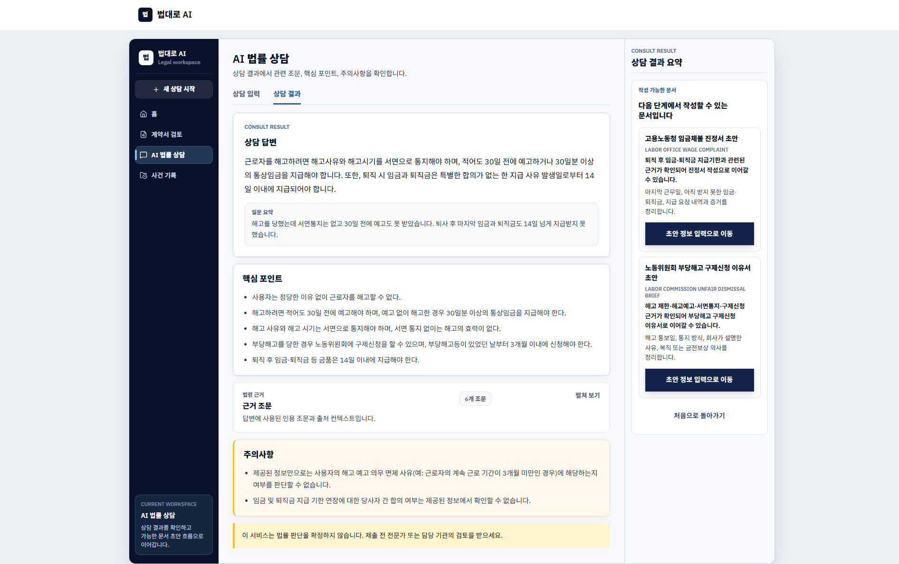</a> | <a href="images/screens/after-consult-foreign-worker.png">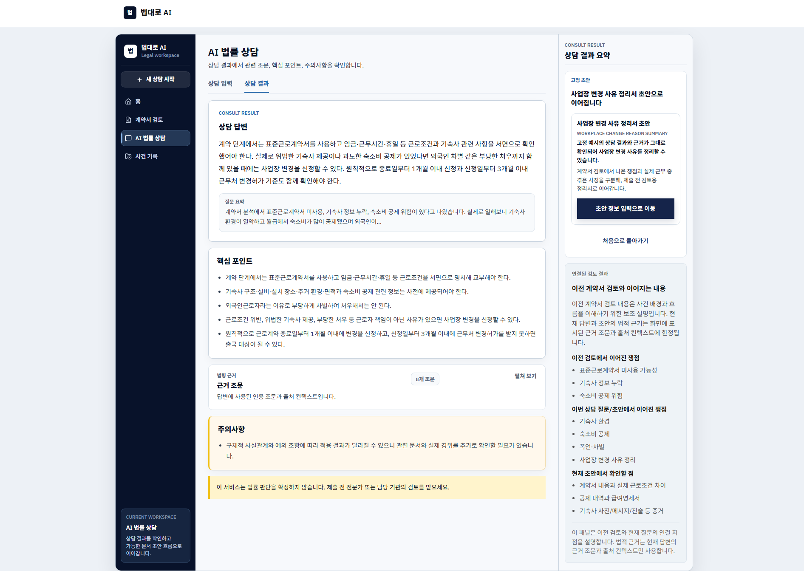</a> |

## 결과와 초안 화면

- 답변 결과 화면은 법령 근거가 충분한 답변과 문서 초안 작성이 가능한 답변을 구분합니다.
- 문서 초안 작성은 근거와 지원 문서 유형이 맞을 때만 열립니다.
- 문서 정보 입력 화면은 제출 전에 선택한 문서 유형이 지원되는지 다시 확인합니다.
- 문서 초안 화면은 초안 본문, 추가 필요 정보, 주의사항, 증거 체크리스트,
  법적 근거, 복사, 브라우저 인쇄를 표시합니다.
- 계약서 검토에서 이어진 상담이나 사용자가 수정한 사업장 변경 상담은
  `사업장 변경 사유 정리서 초안` 예시를 그대로 쓰는 경우를 제외하고
  답변 확인까지만 제공합니다.

| 답변 결과 | 초안 화면 | 상담에서 초안 생성 |
|---|---|---|
| <a href="images/screens/scn001-result.png">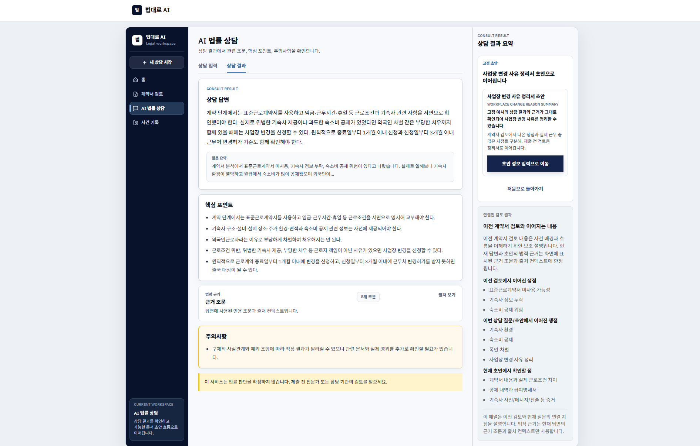</a> | <a href="images/screens/scn001-draft.png">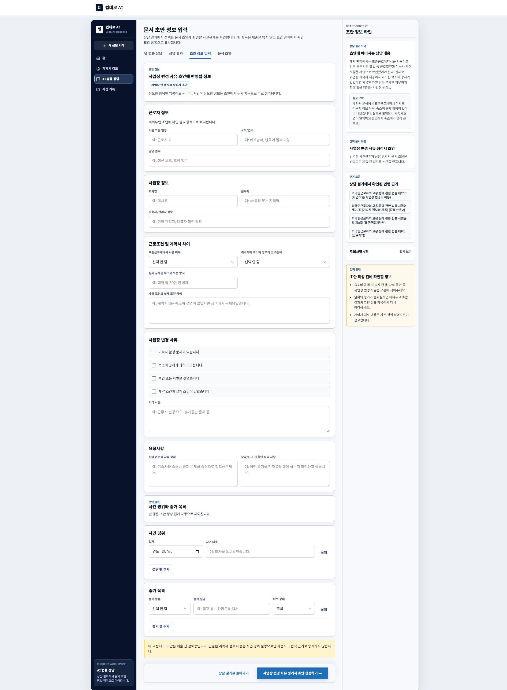</a> | <a href="images/screens/scn001-consult-draft.png">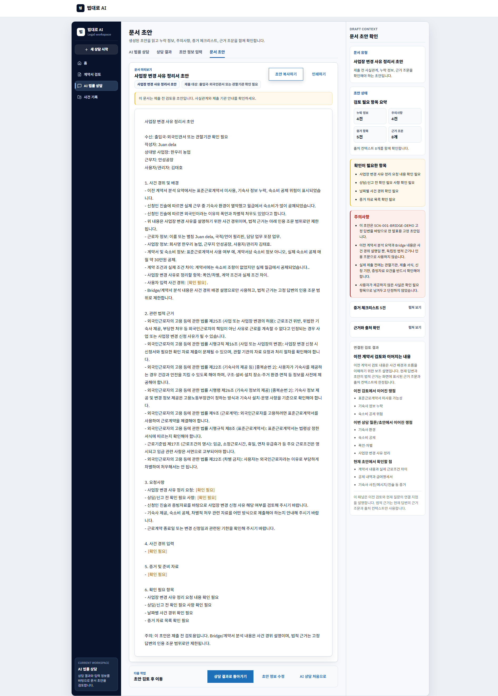</a> |

## 사건 기록 화면

- 기록은 계약서/상담 연결을 분리한 열이 아니라 사건 중심 카드로 보여 줍니다.
- 카드는 상황, 확인된 쟁점, 참고할 법 조항 후보, 권장 다음 단계,
  AI 법률 상담과의 연결점을 요약합니다.
- 실패했거나 아직 진행 중인 계약서 검토는 사용자 목록에서 숨깁니다.
- 기록 삭제는 목록에서 기록을 숨기고, 연결된 상담 선택 상태를 정리합니다.

<a href="images/screens/history-records.png">
  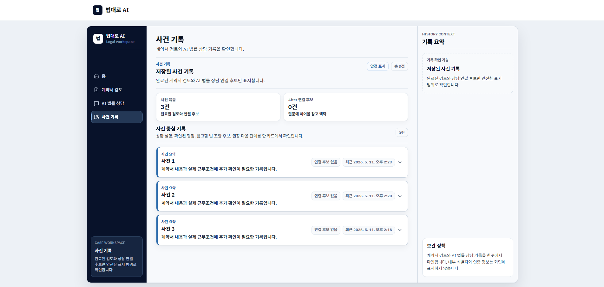
</a>

## 화면 설계 메모

- UI는 차분한 정보 밀도와 근거 중심 설명을 우선합니다.
- 주의 문구와 불확실성 안내는 보이는 상태로 유지합니다.
- 카드는 반복 기록과 명확히 구분되는 도구 영역에 사용합니다.
- 색상 강조는 선택 전 기록과 선택된 상담 연결 상태를 구분하는 데 사용합니다.

## 함께 보기

- [[사용자 흐름|User-Flows]]
- [[설계 원칙|Design-Principles]]
- [[E2E 데모 검증|E2E-Demo-Verification]]
